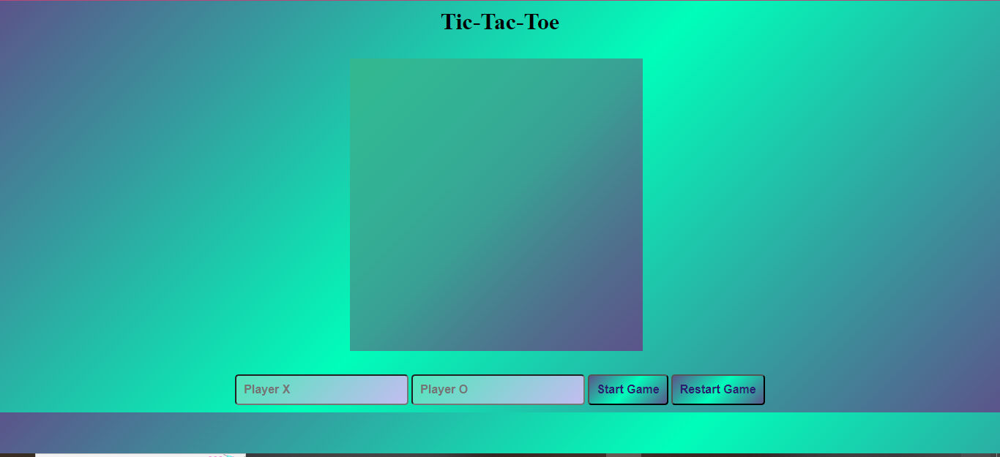

# Tic-tac-toe
A tic-tac-toe game to demonstrate the usage of js module patterns and IIFEs.This simple game takes two players to play. As with tic-tac-toe game, a player wins when a player align same  sign of either "X" or "O" vertically, horizontally or diagonally. More features may be considered to be implemented in the future. Features like ability to play with a computer, different levels of difficulty, and also ability to choose number of cells of either "3 X 3" or "4 X 4".

## Features
This app features a "3 x 3" tictactoe game to be played by two persons. It allows players input their names into the two input fields and play the game. A restart button is also available to be able to start the game afresh at any point.

## Images

### inactive state
The below image shows the app in its inactive state.


### active: error state
The below image shows the app in its active state displaying the "3 X 3" squares after inputing players' name and starting the game.


### active state
The below image shows the app in its active state as the game is been played as seen on the first image while the second image shows a game that is won with a message declaring the winner.


[](./screenshots/active3.png)

## Getting Started

1. Clone the repository to your local machine:

   ```bash
   git clone https://github.com/Mogle7Arkad/my_tictactoe
   ```
2. Open the project folder in your favorite code editor.

4. Locate the `index.html` file and open it in your web browser to use the Weather App.

## Usage

1. Upon opening the app, you will be presented with a screen, two input fields, a start button and a restart button.

2. On inputing player names in the fields, click the start button and the cells will be displayed on the screen.

3. You will click each cell simultaneously between the two players the insert the signs assign to each player.

4. A cell can not be played twice.

5. Immediately any player has his/her sign straight on 3 cells(vertically, horizontally or diagonally), the player is the winner. An alert message is displayed on the screen to announce the winner.

6. If for any reason you wish to start the game afresh, the restart button allows you do that.

## Contributing

This project is open for contributions. If you find any issues or have suggestions for improvements, feel free to open an issue or create a pull request.

## Acknowledgments

- The Odin Project for providing a comprehensive curriculum for web development.

## Built with
- JavaScript
- HTML
- CSS
- Visual Studio Code
- Git & Github
---

### Ps. Pardon the funny looking User Interface